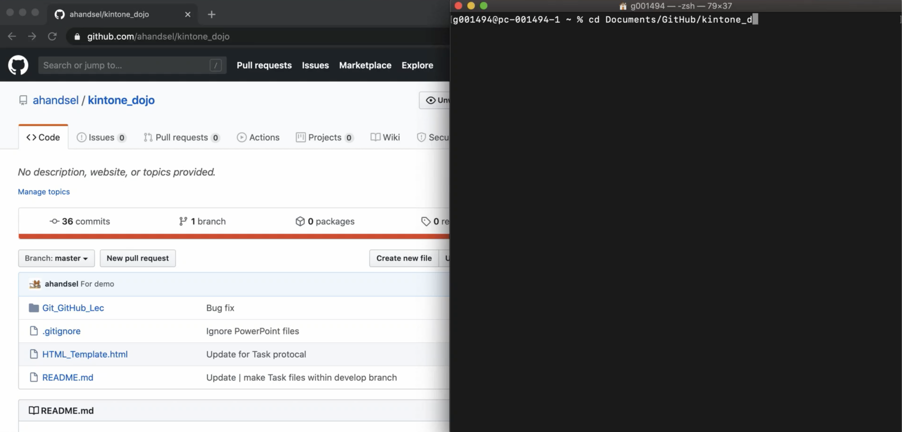

# Kintone_Dojo Repository

## Kintone_Dojo Repoの使用方法：
* :warning: このリポジトリは、Kintone_Dojo割り当ての保存にのみ使用されます！ :warning:
  * :zap: Kintone Dojoの講義内容は別のファイルに保存してください。 :zap:
  * これは、gitコマンドの問題がKintone Dojoの講義を妨害しないようにするためです。

Kintone_Dojoの割り当てを開始するとき：
  1. masterブランチから、 `develop-task##`というタイトルの新しいブランチを作成します。
     1. `$ git checkout -b develop-task01`
  2. 新しいブランチに **Task##** フォルダを作成します。
     1. `$ mkdir Task01`
  3. コードを記述して、このフォルダーにコミットします。
     1. `$ git add Task01.html Task01.js`
     2. `$ git commit -m "Task01 files first draft"`

コードレビューの準備ができたら：
  1. ブランチをGitHubにプッシュします
     1. `git push origin develop-task01`
  2. `develop-task ##`ブランチを `master`とマージするプルリクエストを作成します。
  3. レビュー担当者を割り当てます

## Demo Video
  * [![Task Demo Video @YouTube][/Git_GitHub_Lec/Task_Demo.png]](https://youtu.be/-9amExonLI4)
  * 

## How to use Kintone_Dojo Repo:
* :warning: This repo will only be used for storing Kintone_Dojo assignments! :warning:
  * :zap: Please keep Kintone Dojo lecture content in a separate file. :zap:
  * This is to prevent git command issues from interfering with Kintone Dojo's lectures.

When starting a Kintone_Dojo assignment:
  1. From the master branch, create a new branch titled `develop-task##`.
     1. `$ git checkout -b develop-task01`
  2. Create a **Task##** folder in the new branch.
     1. `$ mkdir Task01`
  3. Write your code and commit to this folder.
     1. `$ git add Task01.html Task01.js`
     2. `$ git commit -m "Task01 files first draft"`

When you are ready for a code review:
  1. Push the branch to GitHub
     1. `git push origin develop-task01`
  2. Create a pull request to merge the `develop-task##` branch with `master`.
  3. Assign your reviewer

<!-- ## Kintone_Dojo Repoの使用方法：
* 1 - 割り当てごとにフォルダを作成します。 （masterブランチ上）
* 2 - develop-task-`#` ブランチを作成する
  * `#` = タスク番号
  * 例：develop-task-01はタスク番号1用です。
  * 進行中のHTMLおよびJSファイルをここに保存します。
  * Markdown（.md）ファイルとして関連するメモを含めます。
* 3 - コードレビューが必要なときにプルリクエストを行う
  * Sohei や Genjiをタグする。
* 4 - レビューが成功した後
  * develop ブランチをmasterにマージ！ -->

## Other...
This repository will be used to store, track,a and submit the code from the Kintone Dojo JavaScript training course for code review.

# Branches
| master branch | contains the deployed code |
| -- | -- |
| develop branch | contains the code currently working on |

Changes for a pull request example
