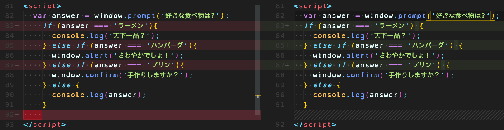

## Masato | Task01 Review | June 12

### 機能:
* コードは正しく機能します。わーい！
### フォーマット：
*エラーは重要な順になっています。*
83, 85, 87行: “if” 文 の「)」と「{」の間にスペースが必要です。
  * リファレンス：[いくつかの条件：「else if」](https://ja.javascript.info/ifelse#ref-329)
  * If... else... 文 フォーマット:
    ```
      if (condition) {
        // code
      } else {
        // code
      }
    ```
92行: 不要な空行。
  * 行を削除してください。
83 ~ 91行: 2スペースのインデントが必要ですが、4スペースインデントがありました。(indent)
  * コードの前のスペースを2にしてください。

English:
---
### Functionality:
* Your code is working exactly as needed! Yay!
### Formatting:
*The errors are in the order of importance.*
Line 83, 85, & 87: a space is needed between ")" and "{" for if statements
  * Reference: [いくつかの条件: “else if”](https://ja.javascript.info/ifelse#ref-329)
  * If... else... statement formatting:
    ```
      if (condition) {
        // code
      } else {
        // code
      }
    ```
Line 92: Unnecessary empty line.
  * Please delete the line.
Lines 83 to 91: Expected indentation of 2 spaces but found 4. (indent)
  * Please reduce the spaces before the code down to 2.
---
