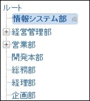
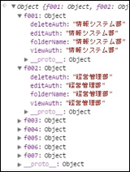
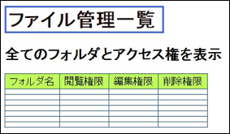
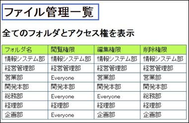
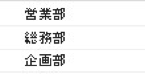

# Task02.md
## Translation

| JP                               | English                            |
| -------------------------------- | ---------------------------------- |
| ファイル管理                     | File Management                    |
| ファイル管理一覧                 | File management List               |
| 全てのフォルダとアクセス権を表示 | Show all folders & access settings |
| フォルダ名                       | Folder Name                        |
| 閲覧権限                         | Read Permission                    |
| 編集権限                         | Write Permission                   |
| 削除権限                         | Delete Permission                  |

## Part 1
* Define the following file structure as an object in JavaScript and check with console.log
  * Object Name = fileManage
  * Try to put an object inside an object
  * The required properties are as follows:

  | Folder ID | Folder Name          | Read Permission | Write Permission | Delete Permission    |
  | --------- | -------------------- | --------------- | ---------------- | -------------------- |
  | f001      | Info Sys Dept        | Info Sys Dept   | Info Sys Dept    | Info Sys Dept        |
  | f002      | Management Dept      | Management Dept | Management Dept  | Management Dept      |
  | f003      | Sales Dept           | Everyone        | Sales Dept       | Sales Dept           |
  | f004      | Development Div      | Development Div | Development Div  | Development Div      |
  | f005      | General Affairs Dept | Everyone        | Everyone         | General Affairs Dept |
  | f006      | Accounting Dept      | Accounting Dept | Accounting Dept  | Accounting Dept      |
  | f007      | Planning Dept        | Everyone        | Planning Dept    | Planning Dept        |

## Part 2
* Display all the values stored in the object in the browser
* Use for loop
* 
* :arrow_right:
* 

## Part 3
* Display files with [ Read Permission ] set to [ everyone ] on console
* 
* Display files with [ Read Permission ] set to [ everyone ] on browser
    * Generate a list of the folders (should be sensitive to the necessary length of the request)
    * 
    * 

---

### 課題 1-1
* 次のようなファイル構造を、JavaScript でオブジェクトとして定義し、console.log で表示を確かめる
* 備考：
  * オブジェクト名は「fileManage」
  * オブジェクトの中にオブジェクトを入れてみる
  * 必要なプロパティは下記の通り

| フォルダID | フォルダ名     | 閲覧権限       | 編集権限       | 削除権限       |
| ---------- | -------------- | -------------- | -------------- | -------------- |
| f001       | 情報システム部 | 情報システム部 | 情報システム部 | 情報システム部 |
| f002       | 経営管理部     | 経営管理部     | 経営管理部     | 経営管理部     |
| f003       | 営業部         | Everyone       | 営業部         | 営業部         |
| f004       | 開発本部       | 開発本部       | 開発本部       | 開発本部       |
| f005       | 総務部         | Everyone       | Everyone       | 総務部         |
| f006       | 経理部         | 経理部         | 経理部         | 経理部         |
| f007       | 企画部         | Everyone       | 企画部         | 企画部         |

### 課題 1-2
* オブジェクトに格納されている値を全てブラウザに表示する
* 備考：
  * for 文を上手く使おう

### 課題 1-3
* 閲覧権限が Everyone にあるフォルダ名をコンソールに表示したい
* 閲覧権限が Everyone にあるフォルダ名をブラウザに表示したい
  * 今度は必要な数だけ、リストを作るような動きにしよう