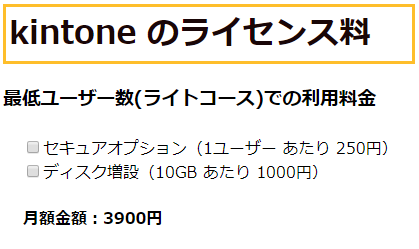
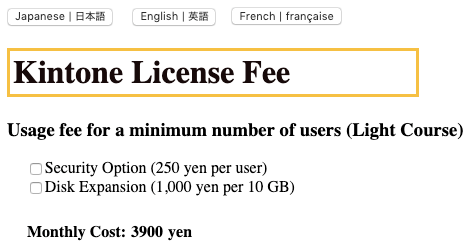
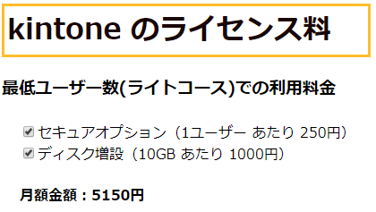
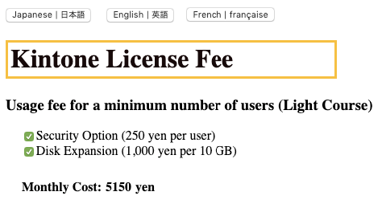
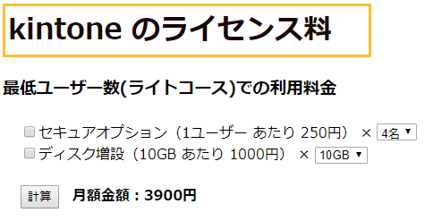
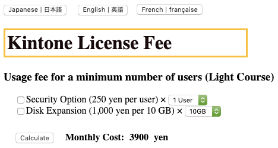
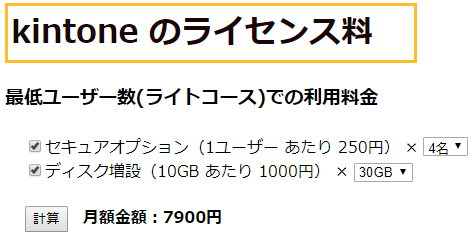
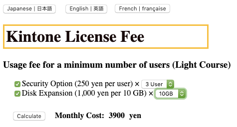

# Task04 Instructions | DojoHW-2
# Translation

| 日本語                                       | English                              |
| -------------------------------------------- | ------------------------------------ |
| kintone のライセンス料                       | kintone license fee                  |
| 最低ユーザー数(ライトコース)での利用料金     | Usage fee for a minimum number of    | users (light course) |
| セキュアオプション（1ユーザー あたり 250円） | Secure option (250 yen per user)     |
| ディスク増設（10GB あたり 1000円）           | Disk expansion (1,000 yen per 10 GB) |
| 月額金額：3900円                             | Monthly amount: 3900 yen             |
| `[0-9]`名                                    | `[0-9]` Users                        |

# Part 1
*   I want to calculate the cost for a minimum user (light course) in Kintone.
*   The options are as follows
    *   Secure option
    *   Disk expansion
*   Costs:
    *   Usage fee for Light Course = 3,900 yen per month
    *   Secure option = 250 yen per user
    *   Disk expansion = 1,000 yen per 10 GB
*   Screenshot Examples:

| Japanese            | English             |
| ------------------- | ------------------- |
|  |  |
|  |  |

# Part 2

*   In Part 1, I cannot calculate based on quantities. I want to be able to calculate the fee based on various quantities to some extent.
*   Make a [calculation] button & when pressed, update the cost based on the selected quantities and options
*   Screenshot Examples:

| Japanese            | English             |
| ------------------- | ------------------- |
|  |  |
|  |  |