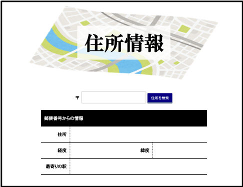

# Task05の手順 (日本語)

### 外部 API を用いて、郵便番号から住所を自動入力しよう。
  * 鉄道までは表示しなくても、OK
  * 今回はCORS対応されていないAPIになりますが、JSONPでやりとりが可能となっています。
  * リクエスト時に「`dataType: 'jsonp'`」も一緒に渡すことでブラウザ上でやり取りが可能となります。

 

### ヒント】
  * [Yahoo! デベロッパーネットワーク](https://e.developer.yahoo.co.jp/dashboard/)を利用する
  * 文字型のデータを特定の文字で分割したい場合は、split() が使える
    * [【JavaScript入門】split()で文字列の分割＆正規表現の活用法まとめ！](https://www.sejuku.net/blog/27672)
    * [split と join by JavaScript.info](https://ja.javascript.info/array-methods#ref-1694)
    * [String.prototype.split() by MDN](https://developer.mozilla.org/ja/docs/Web/JavaScript/Reference/Global_Objects/String/split)

### 参考:
  * [郵便番号検索 API 公式ドキュメント](https://developer.yahoo.co.jp/webapi/map/openlocalplatform/v1/zipcodesearch.html)
  * [Yahoo! APIに関する特約事項](https://about.yahoo.co.jp/docs/info/terms/chapter1.html#cf5st)

---

# Task05 Instructions (English)

### Use the 3rd-party API to automatically get the address based on the provided zip code.
  * Optional: Displaying the trains
  * This API is not CORS compliant, but it is possible to use with JSONP.
  * By passing "`dataType: 'jsonp'`" together with the request, you can communicate on the browser.
  * 
  * 

### Hint:
  * Use [Yahoo! Developer Network](https://e.developer.yahoo.co.jp/dashboard/)
  * Use `split()` to split a string into an array or split a string at a specific character
    * [JavaScript | String split() by GeeksforGeeks](https://www.geeksforgeeks.org/javascript-string-prototype-split-function/)
    * [split and join by JavaScript.info](https://javascript.info/array-methods#split-and-join)
    * [String.prototype.split() by MDN](https://developer.mozilla.org/en-US/docs/Web/JavaScript/Reference/Global_Objects/String/split)

### References:
  * [郵便番号検索 API 公式ドキュメント](https://developer.yahoo.co.jp/webapi/map/openlocalplatform/v1/zipcodesearch.html)
  * [Yahoo! APIに関する特約事項](https://about.yahoo.co.jp/docs/info/terms/chapter1.html#cf5st)